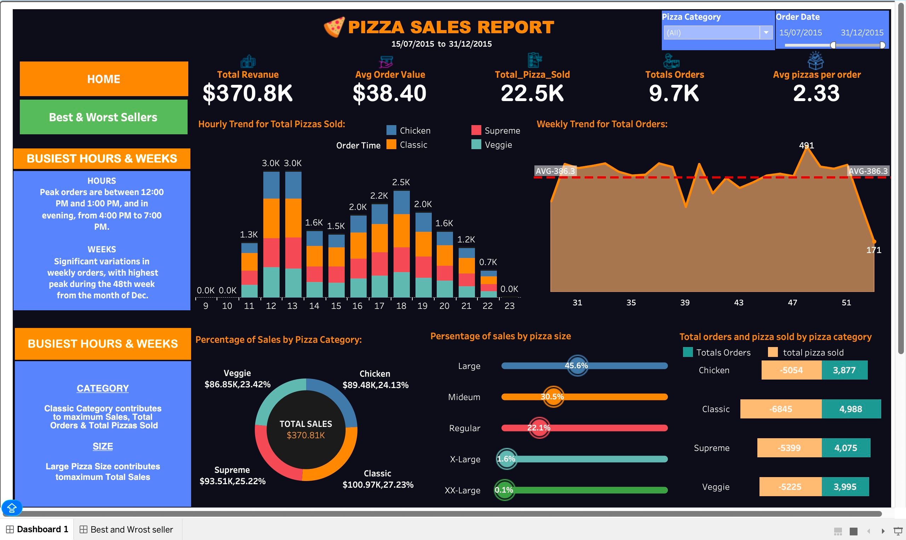
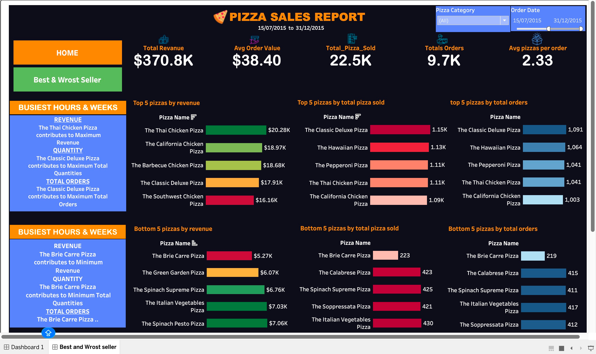

# Pizza-Sales-Analysis-SQL-Tableau
Pizza Sales Analysis project using MySQL and Tableau. Performed data analysis with SQL queries and built an interactive dashboard to track revenue, sales trends, order patterns, and top-performing pizzas.
# Pizza Sales Analysis Dashboard | SQL + Tableau

## Dashboard Preview

## Project Overview

This project analyzes pizza sales data using MySQL Workbench and Tableau. SQL was used for data exploration, KPI calculations, and business analysis, while Tableau was used to create an interactive dashboard for visualization and business insights.

## Objectives

* Analyze overall sales performance
* Identify sales trends and customer ordering patterns
* Evaluate pizza category and size performance
* Determine top and bottom-selling pizzas
* Create an interactive dashboard for decision-making

## Tools & Technologies

* MySQL Workbench
* SQL
* Tableau
* CSV Dataset

## Key Performance Indicators (KPIs)

* Total Revenue
* Average Order Value
* Total Pizzas Sold
* Total Orders
* Average Pizzas Per Order

## Dashboard Insights

### Sales Trends

* Daily Order Trend
* Monthly Order Trend

### Product Performance

* Top 5 Best-Selling Pizzas
* Bottom 5 Selling Pizzas

### Category Analysis

* Percentage of Sales by Pizza Category
* Percentage of Sales by Pizza Size

## SQL Analysis Performed

* Total Revenue Calculation
* Average Order Value Analysis
* Total Orders Calculation
* Total Pizzas Sold Analysis
* Average Pizzas Per Order
* Sales by Pizza Category
* Sales by Pizza Size
* Daily Order Trend Analysis
* Monthly Trend Analysis
* Top 5 Best Sellers by Revenue, Quantity, and Orders
* Bottom 5 Sellers by Revenue, Quantity, and Orders

## Project Files

* SQL_QUERIES.sql → SQL queries used for analysis
* pizza_sales_cleaned.csv → Dataset used for the project
* Dashboard.png → Dashboard Screenshot
* Tableau Dashboard → Interactive visualization

## Business Insights

* Identified the most profitable pizza categories.
* Analyzed customer purchasing behavior.
* Evaluated revenue contribution by pizza size.
* Determined the highest and lowest-performing pizzas.
* Visualized sales trends to support data-driven decisions.

## Author

Dipanshu Thakur

Aspiring Data Analyst | SQL | Tableau | Python | Excel
